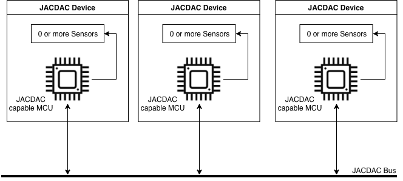
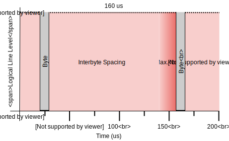
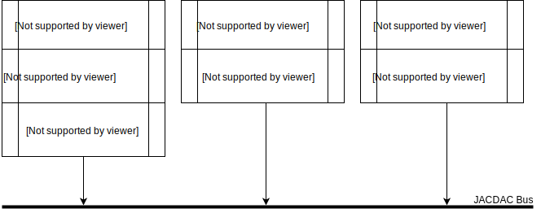
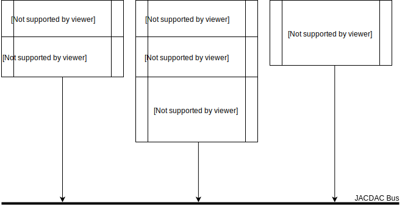
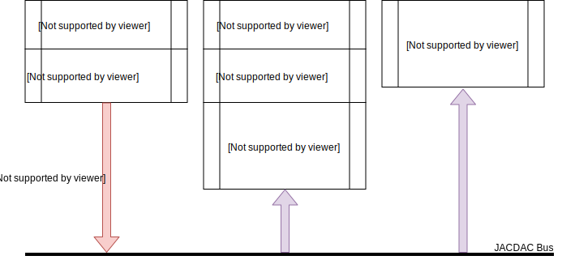
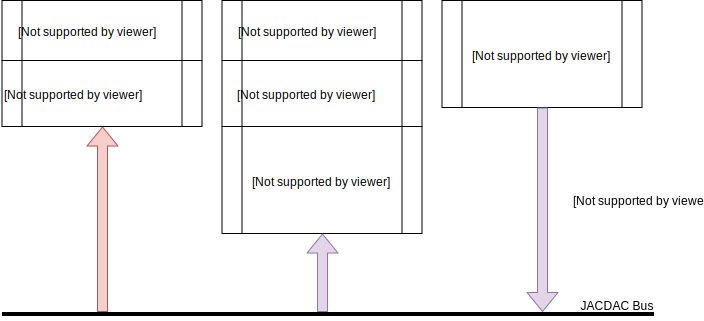
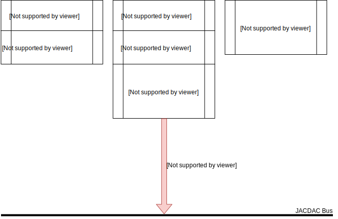
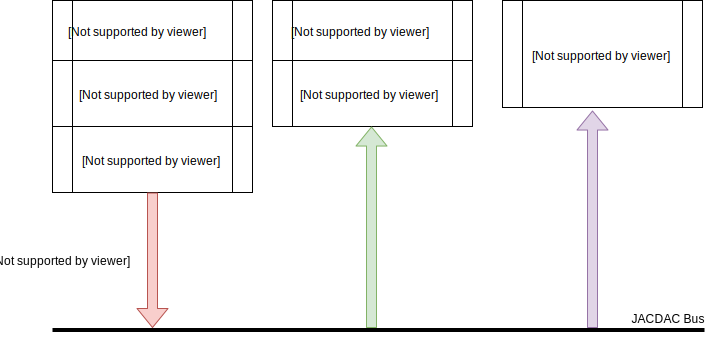
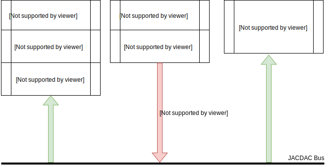
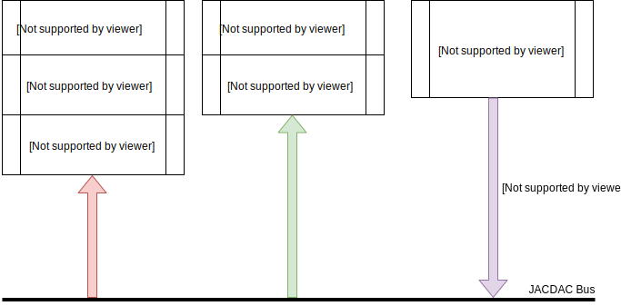

<center>
<b>J</b>oint <b>A</b>synchronous <b>C</b>ommunications; <b>D</b>evice <b>A</b>gnostic <b>C</b>ontrol.<br/><br/><i>A single wire broadcast protocol for the plug and play of accessories for microcontrollers.</i> <br/><br/><u>Authors:</u> <b>J. Devine</b>, <b>M. Moskal</b>, <b>P. Halleux</b>, <b>T. Ball</b>, <b>S. Hodges</b>, <b>J. Finney</b>, <b>T. Seyed</b><br/><br/>

<div style="background-color: #efa6a6;color: black;border: 1px solid #fb7979;text-align: center;border-radius: 10px;"><b>WARNING:</b> JACDAC is very much still under development and subject to change. If you would like to contribute features and ideas, please visit the <a href="https://github.com/jacdac/jacdac">github repository</a> and file an issue.</div>
</center>

# What is JACDAC? <!-- omit in toc -->

JACDAC (Joint Asynchronous Communications; Device Agnostic Control) is a single wire protocol for the plug and play of sensors, actuators, and microcontrollers (MCUs) for use within the contexts of rapid prototyping, making, and computer science education. JACDAC operates in a bus topology and requires devices have a microcontroller with UART, Timer, and GPIO interrupt capabilities.

Please visit the [motivation](#motivation) section to read about the motivating factors for JACDAC.

# Contents  <!-- omit in toc -->
- [Protocol Overview](#protocol-overview)
- [Physical Layer Specifications](#physical-layer-specifications)
  - [Hardware Requirements](#hardware-requirements)
  - [Hardware Organisation](#hardware-organisation)
  - [JACDAC Packet Format](#jacdac-packet-format)
  - [Transmission & Reception](#transmission--reception)
  - [Physical Layer Timings](#physical-layer-timings)
    - [Bus Idle Spacing](#bus-idle-spacing)
    - [InterLoData Spacing](#interlodata-spacing)
    - [Interbyte Spacing](#interbyte-spacing)
    - [Interframe Spacing](#interframe-spacing)
  - [Error Detection and Recovery](#error-detection-and-recovery)
  - [Preventing Bus Collisions](#preventing-bus-collisions)
- [Control Layer](#control-layer)
  - [Control Packet Format](#control-packet-format)
    - [Extracting ServiceInformation](#extracting-serviceinformation)
  - [Device Address Allocation](#device-address-allocation)
  - [Device Address Collisions](#device-address-collisions)
    - [Device Removal](#device-removal)
  - [Routing Packets](#routing-packets)
  - [When is enumeration required?](#when-is-enumeration-required)
- [Services](#services)
  - [HostServices](#hostservices)
  - [ClientServices](#clientservices)
  - [Broadcast](#broadcast)
  - [Addressing](#addressing)
    - [Host and Client Addressing](#host-and-client-addressing)
    - [Broadcast Addressing](#broadcast-addressing)
  - [Dynamic Service Addition](#dynamic-service-addition)
  - [Service Status Codes](#service-status-codes)
- [Glossary](#glossary)
  - [Physical Layer Terminology](#physical-layer-terminology)
  - [Device Terminology](#device-terminology)
  - [Service Terminology](#service-terminology)
- [Motivation](#motivation)

# Protocol Overview

**JACDAC** uses the built-in UART module common to most MCUs as its communication mechanism, but instead of separate wires for transmission and reception, JACDAC uses just one wire for both. Four baud rates are supported: 1Mbaud, 500Kbaud, 250Kbaud, 125Kbaud, allowing cheaper MCUs to be used.

Microcontrollers that run the JACDAC protocol are known as **JACDAC devices**. They communicate **JACDAC Packets** to each other across a shared bus in a bus topology. Devices signal a packet transmission by driving the bus lo for a period of time known as the **lo pulse**. The length of the lo pulse dictates the baud rate of the upcoming UART transmission of a JACDAC packet.

Conventionally in bus topologies there is the concept of a Master and Slave (widely regarded as outdated terminology). **JACDAC devices** are all Masters on the bus and instead run **Services** that operate in either **Host** or **Client** modes. **HostServices** allow other devices to configure and use resources that they would normally not have access to, examples include: an AccelerometerService, a DisplayService, or a NeopixelService. A **ClientService** interacts with HostServices as part of a microcontrollers' application.

A device can enumerate one or more **HostServices** on the bus using a **ControlPacket**, which is a JACDAC Packet that contains: a 64-bit **unique device identifier**, the allocated **device address**, and an array of **ServiceInformation** which details the HostServices available for use by the bus. Enumeration is only required if a device is running a HostService; unenumerated devices are free to use enumerated services without enumerating themselves. The presence or absence of device ControlPackets indicates whether a device has been connected or removed from the bus.

Each JACDAC device has a simple stack featuring: (1) a physical layer handling the transmission and reception of packets; (2) a control layer which performs the routing of packets; to (3) services running on the device. Complexity of the JACDAC stack scales with the capability of the microcontroller.


<!-- ## Features
**TODO:**
  - Reuse of existing hardware: most MCUs
  - One wire
  - Multi-master operation
  - Plug and play
  - Multi-baud support
  - Code Re-use and Extensibility
  - Sharing of peripherals

 -->

# Physical Layer Specifications

This section describes the hardware requirements, packet format, and the logic line level transmission process. Protocol timings are generally described in terms of bytes: *a byte is 10 bits*, as 1 UART start and stop bit are included in the total size.

## Hardware Requirements

To operate on the JACDAC bus, an MCU must be capable of:

  - Communicating / receiving UART-style bytes using a single wire. (10 bits: 1 byte, 1 stop bit, 1 start bit).
  - Reaching one of four baud rates: 1Mbaud, 500Kbaud, 250Kbaud, 125Kbaud.
  - A GPIO with PullUp capabilities and interrupts. It’s far easier if the pin used for UART tx/rx can also generate GPIO interrupts(especially in CODAL).
  - The ability to keep time (whether through instruction counting or a hardware timer).
  - The ability to generate random numbers (or at least seed a software random number generator).


## Hardware Organisation



A JACDAC device should feature one JACDAC capable microcontroller that is connected to zero or more sensors over an onboard communication protocol such as I2C or SPI. The JACDAC microcontroller should also have the capability to connect to the JACDAC bus to communicate with other JACDAC devices.


## JACDAC Packet Format

The table below specifies the packet structure of JACDAC packets transmitted on the bus. Bytes are sent in little endian format. For more detail on each field please visit the [software layer](#software-layer) section of this document.

| Field Size (bits) | Name            | Description                                                        |
| ----------------- | --------------- | ------------------------------------------------------------------ |
| 12                | CRC             | The CRC field calculated using the polynomial `0xF13`. When calculating the CRC for a JACDAC packet, the unique device identifier of the destination device must be included. When computing the CRC for a ControlPacket, the crc must be calculated with no unique device identifier.                        |
| 4                 | service\_number | A number that identifies a service on a device. Discussed further in the [Control Layer](#control-layer) section.                 |
| 8                 | device\_address | A number that identifies a device on the bus.                      |
| 8                 | size            | The size of the data field. Values range from 0-255.|
| 8 \* size         | data            | An array of bytes, whose size is dictated by the size field above. |

The packet structure is divided into two parts:

* *header*: the crc, service\_number, device\_address, size, and version fields before the data field.

* *data*: the data field onwards.

A frame refers to a packet that is sent on the bus and includes the bus arbitration process.


## Transmission & Reception

When the JACDAC bus is in idle state, all MCUs on the bus must configure their TX/RX pin to be an input with a pull up to 3.3v. In this state, the bus will read high.

When an MCU wants to transmit a packet, it must drive the bus low for 10 bits (1 byte) at the desired baud rate and wait for a minimum of 4 bytes at 1Mbaud before transmitting data. This is known as the lo pulse, the duration of this pulse dictates the baud rate of the upcoming UART transmission:

| Pulse Duration (us) | UART Baud Rate (KBaud) |
| ------------------- | ---------------------- |
| 10                  | 1000                   |
| 20                  | 500                    |
| 40                  | 250                    |
| 80                  | 125                    |

When an MCU detects the beginning of a transmission (a low pulse), it has a minimum of 40 microseconds (4 bytes at 1Mbaud) and a maximum 160 microseconds (2 bytes at the 125Kbaud) to configure any hardware registers and software buffers to receive a JACDAC packet header. After receiving the header, an MCU should either receive the remainder or ignore a packet. A JACDAC packet that is transmitted on the wire is known as a frame as a frame includes the bus arbitration period as well as the packet itself.

Devices that communicate at baud rates faster than 125Kbaud must also be capable of communicating at all slower baud rates e.g. a device that communicates at 1Mbaud must also be able to communicate at 500, 250, and 125 Kbaud.

It should be noted that despite supporting lower baud rates, developers must achieve the maximum baud rate possible with their chosen MCU. This is for reasons of bus efficiency, as the presence of a large number of slower devices reduces the throughput of the bus.

The process described is visualised in the image below: the bus is high for a period of time, driven low for 10 microseconds (10 bits at 1Mbaud), data following 40 microseconds later.


## Physical Layer Timings

This section specifies expected and maximum timings at the physical layer. If any of the following timings are violated, devices must enter an error state and resume listening for frames once the bus idle period has been detected


### Bus Idle Spacing

If a device chooses to ignore a packet or an error condition is detected when receiving a packet, a device needs to determine when the bus has entered an idle state.

An idle bus is defined as no activity (line hi) for 2 bytes at 125kbaud (160 microseconds).


### InterLoData Spacing

The minimum time before data can be sent after a lo pulse is 40 microseconds, and the maximum gap before data begins is 160 microseconds (two bytes at the lowest baud); times are relative from the end of the lo pulse. All devices must enter an error state if a transmitting device exceeds this time.


### Interbyte Spacing

The maximum permitted time between bytes is two bytes at the minimum baud rate (125KBaud). A transmitting device must never near the maximum interbyte spacing. All devices must enter an error state if a transmitting device exceeds this time.




### Interframe Spacing

The minimum space between frames is two bytes at the minimum baud rate (125KBaud). JACDAC devices should capture the time after receiving the last byte of a packet and observe the minimum interframe spacing. To prevent transmission of a frame at the same time as another device, devices must implement a random backoff for transmission.


## Error Detection and Recovery

If any of the [protocol timings](#protocol-timings) are violated a device must enter an error state and wait until the bus is idle for the bus idle period.

To detect the idle period, a device must capture the time from when the bus last transitioned from lo to hi, resetting this time if the bus transitions again.

A state diagram for error detection when receiving a packet is shown below:


## Preventing Bus Collisions

Bus arbitration is performed through pulsing the bus low for 10 bits at the desired baud rate. However, a device could disable GPIO interrupts and initiate the process of transmission by driving the bus low whilst another device is doing the same:


The diagram above exemplifies the race condition described previously showing two overlapping lo pulses and communications.

To prevent the race condition, JACDAC devices must check the bus state before beginning the lo pulse:


If the bus state is lo when performing this check, devices must enter an error state (as the lo pulse may be improperly measured) and wait for the bus to return to idle.

If two devices begin the lo pulse at exactly the same time, the UART module on the transmitting MCU will detect an error
(most likely a framing error), and the received crc will be incorrect.

<!--  -->


# Control Layer

This section discusses the control layer and specifies: the purpose and implementation Control Packets, device address assignment, and the routing of packets to Services.

Each device must have a **Control Layer** responsible for sending a **ControlPacket** every 500 ms. A ControlPacket contains information about a device including: a unique device identifier (udid), device address, and available HostServices for use by the bus.

ControlPackets are embedded in the content of a standard JACDAC packet which has the `device_address` and `service_number` fields set to zero.

The address zero must never be used as the `device_address` by any device, and should be thought of as a reserved broadcast address for Control operations.

<!-- reducing the overhead of individual JACDAC packets. -->

## Control Packet Format

A ControlPacket has multiple purposes:

  1. To facilitate the allocation of device addresses on the bus.
  2. To reduce the overhead of standard JACDAC packets by providing meta data and addressing information for the routing of packets to services.
  3. To allow JACDAC devices to determine if a device has been connected or removed from the bus.

It has the following structure:

| Field Size (bits)      	| Name           	| Description                                                                                        	|
|------------------------	|----------------	|----------------------------------------------------------------------------------------------------	|
| 64                     	| udid           	| The unique device identifier (udid) for the device.                                                	|
| 8                      	| device_address 	| The address allocated to the device that occupies the address field of a JACDAC packet             	|
| 8                      	| device_flags   	| A field for the ControlService indicating the state of a device.                                   	|
| N * ServiceInformation 	| data           	| The data field is filled with an array of HostServices operating on the device for use by the bus. 	|

The possible values of the `device_flags` field values are defined as follows:

| Bit Mask (hex)     	| Name           	| Description                                                                                        	|
|------------------------	|----------------	|----------------------------------------------------------------------------------------------------	|
| 0x0fasd                    	| REJECT           	| The unique device identifier (udid) for the device.                                                	|
| 0x0fasd                	| PROPOSAL 	| The address allocated to the device that occupies the address field of a JACDAC packet             	|
| 8                      	| device_flags   	| A field for the ControlService indicating the state of a device.                                   	|
| N * ServiceInformation 	| data           	| The data field is filled with an array of HostServices operating on the device for use by the bus. 	|

The data field of a ControlPacket contains one or more ServiceInformation structs which have the following structure:

| Field Size (bits)      	| Name               	| Description                                                                                            	|
|------------------------	|--------------------	|--------------------------------------------------------------------------------------------------------	|
| 32                     	| service_class      	| This field indicates the type of service, much like a HID class used in USB.                           	|
| 8                      	| service_flags      	| Flags for the service, optionally populated by a Service                                               	|
| 4                      	| service_status     	| The status of the service. Used to indicate runtime errors.                                            	|
| 4                      	| advertisement_size 	| A field that indicates the whether advertisement data is present. A maximum of 15 bytes are available. 	|
| 8 * advertisement_size 	| advertisement_data 	| Optional advertisement data indicating runtime properties of the service.                              	|

### Extracting ServiceInformation

The data field of a ControlPacket should be parsed as follows:

  1) Inspect the size of the JACDAC Packet, and subtract the size of a ControlPacket header (10 bytes), the remainder will be the size of the data field called `data_field_size`. Create a variable called `offset` set to zero
  2)  Is `offset` == `data_field_size`? If yes go to 4.

  3) Iterate over the `ControlPacket->data` field:
      - Cast the `ControlPacket->data + offset` to a `ServiceInformation` struct.
      - Determine if the `ServiceInformation` matches services running on the device.
      - Read the value of the `advertisement_size` field and extract advertisement data (if required).
      - Add `advertisement_size` to `offset`.
      - Is `offset` >= `advertisement_size`? If no go to 2.
  4) Finished


## Device Address Allocation

When a device is first connected to the bus, it must obtain an address to use. The process to obtain an address is known as **enumeration** and a device is said to be **enumerated** when it has a confirmed address. Enumeration uses ControlPackets to obtain an address, and as in normal operation devices must emit ControlPackets every 500 ms. Other devices must only use services that are offered by a device once it is enumerated.

When enumerating, devices must propose an address to use by setting the `device_address` and the `PROPOSAL` flag in its ControlPackets. If an enumerated device on the bus is already using the proposed address, the enumerated device must return the same ControlPacket with the `REJECT` flag set. If a proposing device receives the previously sent ControlPacket with the `REJECT` flag set, it must pick a new address and begin the proposal phase again. Similarly, if the proposing device receives a ControlPacket from another device using the proposed address, it must pick a new address and begin the proposal phase again (this may be the case if the proposing device communicates at an incompatible baud rate for another MCU). If two devices propose to use the same address, the [address collision](#device-address-collisions) rules must be observed.

After two ControlPackets without rejection, a proposing device is considered bound to that address. A bound address is indicated by the absence of the `PROPOSAL` flag.


## Device Address Collisions

Address collisions are identified by a device receiving a ControlPacket containing its `device_address` and a different `udid`. It is likely that there will be address collisions if two large, established buses are joined together.

On the occurrence of an address collision, the device that detected the colliding ControlPacket must begin the enumeration process again to establish a new address. In other words, the first device to communicate a ControlPacket when two buses are joined remains bound to that address.

Less capable MCUs that are unable to receive ControlPackets at higher baud rates (and thus won't detect an address collision) will remain on their addresses, whilst more capable MCUs will be forced to re-enumerate on the bus.


### Device Removal

If a ControlPacket is not seen from a device for **1 second** (2 ControlPackets), the device is considered removed.

## Routing Packets

After a device has enumerated on the bus, it may receive a JACDAC packet from another device that requires on-device routing to the intended service.

A JACDAC packet contains a `device_address` and `service_number` field, which when combined identify a service running on a device. ControlPackets contain the necessary metadata to map a JACDAC packet to a corresponding device and service. If a JACDAC device requires a packet to be routed to a service it must maintain the relevant state contained in a control packet.

The `device_address` can be directly obtained from the `device_address` field of a ControlPacket. However, the `service_number` must be calculated by determining the position of the relevant ServiceInformation in the array contained in the data payload of a control packet:

```
ControlPacket:
  device_address: 3
  unique_device_id: 1235464738
  flags: 0
  data:
    Service:
      service_class: Button
      flags: 0
      status: 0
      advertisement_size: 0
    Service:
      service_class: Accelerometer
      flags: 0
      status: 0
      advertisement_size: 0
    Service:
      service_class: Servo
      flags: 0
      status: 0
      advertisement_size: 0
```
A JACDAC packet addressed to the Accelerometer service using the ControlPacket above would look as follows:

```
JACDAC Packet:
  crc: XXXX
  service_number: 1
  address: 3
  size: 6
  data:
    x: 999
    y: 20
    z: 500
```

By maintaining a small amount of state, minimal metadata is placed in a JACDAC packet allowing more space for service data.


<!-- ## Pairing Devices? -->

## When is enumeration required?

Device enumeration is only required when a device is running a HostService for others on the bus. If a device seeks only to use a HostService via a ClientService, device enumeration is not required.

# Services

**Services** are advertised by JACDAC devices on the bus and build on the Control Layer. They expose APIs for programmers to access, actuate, and network with other devices on the bus.

The ServiceInformation structure inside ControlPackets contain information about a Service, such as:

* The service class – a 32-bit number that identifies a type of Service such as an accelerometer or a joystick.
* Any service flags – Flags indicating the current state of the service.
* The service status – Other devices/services can check this field to determine if a Service has a runtime error (See [Service Status Codes](#service-status-codes)).
* Optional service advertisement data – Each service can place an optional application payload in ControlPackets for other services to consume.

At runtime, Services send JACDAC packets placing the `service_offset` and `device_address` into each packet.

There are three modes of operation for a service:

  1. **Host Mode** – Host mode should be used by services that offer a resource for other devices to use on the bus. In this mode services are enumerated on the bus via ControlPackets.
  2. **Client Mode** – Client mode should be used when a device wants to use a resource offered by another device (a Service in Host mode). In this mode a service is not required to enumerate on the bus.
  3. **Broadcast Mode** – Broadcast Host mode should be used by Services want to share or consume a resource but also want to collaborate between Services of the same **class** on the bus. Broadcast mode is combined with either Host or Client modes. Enumeration is required in Broadcast Host mode, but not in Broadcast Client mode.

The three modes above allow two communication paradigms to be achieved:

  * Single Host, many Client – A single host can have multiple Clients, like a Server can have multiple clients in a traditional Server-Client architecture.
  * Many Host, Many Client – Combining Hosts and Clients in Broadcast mode enables multicast communications.

<!-- Single control over another device (as in I2C) will be covered [later in this document](#pairing-devices). -->


## HostServices



The diagram above shows an established JACDAC network with three devices connected to the JACDAC bus. Each device in the diagram is organised as specified in the `ControlPacket` struct: device information followed by one or more services. Each device has an address and is providing different HostServices on the bus.

In this example there are no Clients for any of the services so the Control Layer will not perform any routing of packets, unless a service is directly addressed by combining the `device_address` and `service_number`.

When a HostService receives a packet, it has no ability to determine the source address of the packet unless additional metadata is place inside the data field.

Devices can enumerate up to 16 HostServices on the bus.


## ClientServices



The diagram above shows an established JACDAC network with three devices connected to the JACDAC bus. Only one device (20) is presenting a HostService to the bus, this device in the diagram is organised as specified in the `ControlPacket` struct: device information followed by one or more services.

The two remaining devices (middle, right) are not enumerated on the bus, but are accessing the Pin HostService on device 20 using ClientServices. By inspecting the information provided in ControlPackets, the Control Layer on each device has routed the ControlPackets from the Pin HostService (20) to the Pin ClientServices. The Pin ClientServices have stored the routing information (`device_address`, `service_number`) of the Pin HostService (20), so that when a programmer uses the service in a program resulting packets will be addressed to the Pin HostService.

When a service has stored routing information to a service running on another device, we say that the Client has **bound** to the host. When a ClientService is bound, the Control Layer must maintain the state of the bound service by forwarding ServiceInformation from ControlPackets and detecting if the device operating the service has been removed from the bus. If the HostService used by a ClientService disappears from the bus, the Control Layer must detect the absence of a device and signal to any matching services that a device has disappeared. Matching services must then enter an uninitialised state and wait for the Control Layer to route the ControlPackets of another device that is providing a matching HostService on the bus.

When sending packet to a bound host, a ClientService must use the `device_address` and `service_number` of the bound host. In this sense, a ClientService can be thought of as a stub of a HostService.


## Broadcast


The diagram above shows an established JACDAC network with three devices connected to the JACDAC bus. Devices 20 and 50 are presenting HostServices to the bus and in the diagram are organised as specified in the `ControlPacket` struct: device information followed by one or more services. In this example three devices are running the MessageBus service and are sharing primitive event information with each other via the JACDAC bus.

All devices are operating a Message Bus service in Broadcast mode. Broadcast mode allows Services to receive packets by `service_class` in addition to normal addressing (combining `device_address` and `service_number`). The Control Layer must route packets to services running in Broadcast mode by maintaining the state of other devices featuring Services with matching class numbers.

Usually, when a Service is running in Host mode, no additional device state is maintained. However, when a Service is running in Broadcast Host mode the Control Layer must provide a mapping from a normal address (`device_address` and `service_number`) to a class, as packets contain no `service_class` metadata and services transmit packets using their own address. As a result, Broadcast services require more RAM to operate.

In the example above, the Control Layer on device 50 is not maintaining the state of the device on the right as it is not enumerated, however, it is maintaining the state of device 20. Applying this logic to the Control Layer of device 20, we can deduce that it will maintain the state of device 50.

The device on the right of the diagram is running the MessageBus service in Broadcast Client mode, is not enumerated, and is bound to the MessageBus service of device 20. In this case, the MessageBus service is already maintaining the state of device 20 and a mapping is not required. However, the Control Layer of this device must maintain the state of device 50 to route packets packets correctly.


## Addressing

This section formalises the addressing scheme for devices and services in Host, Client, and Broadcast modes.

There are two modes for addressing:
1. Normal mode – Where the `device_address` and `service_number` fields in a JACDAC packet are used to route a packet.
2. Broadcast mode – Where the `service_class` is used to route packets. This mode operates in conjunction with normal mode.

The colour of the arrows in the following diagrams indicates the addressing and service modes:

* Purple arrows show a client service operating in normal addressing mode.
* Red arrows show a host service operating in normal addressing mode.
* Green arrows show a service operating in broadcast addressing mode.

### Host and Client Addressing



The diagram above shows a Host Service sending a packet using its address. The packet is received by the ClientServices bound to device 20.



The diagram above shows a Client Service sending a packet using the `device_address` 20 and `service_number` of 0. The packet is received by the additional ClientService bound to device 20, and device 20 itself.



The diagram above shows a Joystrick Host Service sending a packet using the `device_address` 198 and `service_number` of 0. The packet is received by all devices on the bus, but is not routed to any service (hence the arrows are omitted) because no Client or Broadcast services exist on any of the devices.

### Broadcast Addressing



The diagram above shows a Broadcast Host Service sending a packet using the `device_address` 20 and `service_number` of 0. The packet is received using broadcast addressing by device 50 and received using client addressing by the third device, which is bound to device 20.



The diagram above shows a Broadcast Host Service sending a packet using the `device_address` 50 and `service_number` of 0. The packet is received by device 20 and the un-enumerated third device using broadcast addressing.



The diagram above shows a Broadcast Client Service sending a packet using the `device_address` 20 and `service_number` of 0. The packet is received by device 20 using Host addressing and by device 50 using broadcast addressing.


<!-- ## Pairing Devices

The three modes listed above, omission master/client etc.?

Paired mode allows devices to have exclusive access to another device.

In Paired mode, two services are notionally bonded to each other at the software level. In this example there are three services: A paired host, a paired virtual, and an uninitialised virtual service. It is important to highlight that although a host is present on the bus, only one virtual service is initialised as logic services external to the pairing ignore packets emitted from these services until they are unpaired––hence the virtual service is not initialised.

When paired to another service, JDServices create a Virtual stub of their partner and can observe standard packets emitted by them. Services should guarantee that when paired, only their partner can access and configure them. The Virtual stub allows connection events to be detected and handled.

In the diagram, it should also be noted that the Paired service is a Virtual stub with its own address. All API calls via the virtual stub are sent using the VirtualStubs *own address*; the PairedHost receives *packets from its partner* and can act accordingly. -->

## Dynamic Service Addition

JACDAC does not support service addition or removal whilst a device is enumerated. If a service needs to be added or removed then the device must un-enumerate, add or remove the service and re-enumerate.

## Service Status Codes


# Glossary

  - JACDAC - Joint Asynchronous Communications; Device Agnostic Control
    (JACDAC) is a single wire protocol for the plug and play of sensors,
    actuators, and microcontrollers for use within the contexts of rapid
    prototyping, making, and computer science education.

## Physical Layer Terminology

  - Physical Layer - The layer that handles transmission and reception
    of packets with other devices. Specifically, we refer to the line
    level state i.e. what a packet looks like.
  - Bus - JACDAC devices are connected to each other using a “single
    cable”. This is simply a conceptual notion, as JACDAC devices can be
    connected with multiple cables.
  - Packet (commonly referred to as a JDPacket) - The structure of the
    data packet transmitted on the Bus.
  - Lo Pulse - The period for which the bus is driven lo (10, 20, 40, or
    80 microseconds), indicating the upcoming baud rate of the packet.
  - Frame - A frame is formed of a Lo Pulse followed by a packet.

## Device Terminology

  - Device - A JACDAC device is composed of 0 or more services.
  - Device address - Identifies a device and its capabilities.
  - Unique device identifier (previously serial number) - uniquely
    identifies a device, using EUI64 format. Any JACDAC device must have
    a unique identifier.

## Service Terminology

  - Service (previously service) - An interface to the JACDAC bus that
    provisions a resource for a user.
  - Service State (previous device) - Maintains the state of a service
    at runtime.
  - Service Class (previously service class) - provides typing for a
    service i.e. an accelerometer
  - Host Service - Hosts a resource for others to use on the bus. This
    type of service is enumerated on the bus in control packets.
  - Client Service - Uses a resource provided by a host on the bus. This
    type of service is not enumerated on the bus.
  - Host Broadcast Service (previously broadcast service) - Packets are
    received based on class in addition to receiving packets directly
    using address and service number.
  - Client Broadcast Service (Previously SnifferService) - Packets are received based on class and cannot be received directly as the service is not enumerated in control packets. This can be thought of as “wireshark” for a specific service class.
  - Control Service - Handles the routing of packets to the appropriate
    services and the mounting / unmounting of devices. The control
    service is not enumerated on the bus and is addressed using the
    special broadcast session identifier “0”.
  - Control Packet - A control packet enumerates a device on the bus and
    contains the unique device identifier and the services it is
    presenting for others to use.
  - ServiceInformation - is the name for the services data provided in a
    control packet.
  - Service Number - When combined with a device address, it allows the
    identification of a specific Host Service on a device.

# Motivation

Microcontrollers (MCUs) are traditionally used to monitor and actuate our environments (the Internet of Things), to prototype new products for consumers, and to enhance the creations of hobbyist-makers. However, more recently MCUs are being used to educate children on the fundamentals of computer science, helping them to understand the increasingly technologically dense world around them.

What is striking about the previous statement is the revelation that MCU programming has transformed from a *highly specialised domain*
(requiring the knowledge of low-level programming languages and the installation of complex toolchains) to a *more approachable, accessible domain*––children can now write and compile complete programs directly in a web browser using simpler higher-level programming languages. Even more striking is the *power of* these higher level languages: one can write complete I2C or SPI services without learning any C++.

Of course, children are not writing SPI or I2C services in these higher level languages, but rather *businesses looking to create accessories*
featuring peripherals that enhance the base offerings of the educationally focussed MCU boards they use. Businesses use these higher level languages because they are simpler than C or C++, and service code is portable to any other MCU in the language ecosystem.

I2C and SPI are widely used for communicating with peripherals and for good reason: these protocols are efficient, fast, and well-defined. However, whilst these protocols are great for peripherals mounted on the
*same* circuit board, they are hard for novice users to use with
*external* peripherals: asking a classroom of thirty 11––12 year old children to connect four wires correctly results in many failing peripherals.

Various educational MCU-boards have devised solutions for this problem:
the Arduino ecosystem uses “shields”, a set of stackable peripheral boards that can only be plugged one-way to reach the main MCU. Also used by Arduino are grove connectors, a simple wire based ecosystem that allows the one-way connection of peripherals using a rugged connector. Other devices create custom connectors: the micro:bit features an edge connector for GPIO that allows easier, direct integration with accessories. Each of these approaches has a drawback: Arduino shields cannot be mounted anywhere other than directly onto the main board, grove connectors still require learning and expertise to connect things together, and the micro:bit’s edge connector only allows a limited number of accessories to be connected at a time; all approaches increase the overall cost of accessories.

As well as requiring an understanding of basic electronics, the programming interface provided by I2C and SPI is conceptually low-level:
it uses addresses and registers to communicate with peripherals. Each I2C or SPI component has its own register layout that is chip specific––each different model of accelerometer will have a different register map. Unfortunately, this means that whilst service code can be ported to any MCU in the language ecosystem, the addresses and registers used by service code are specific to each peripheral. For I2C the situation gets more problematic as each model of a peripheral is assigned a device address which is peripheral unique, but not chip unique, so if two of the same model of peripheral are connected to the bus, addressing collisions occur.

However, the greatest problem with I2C or SPI is the communication paradigm: Host / Peripheral (used in place of outdated Master / Slave terminology). This paradigm dictates that a single device orchestrates the operation of all devices on the bus, manually configuring, writing, and reading their memory. This scenario caters well for when there is only one Host device on the bus, but what if you want two Host devices to communicate with each other? Or you want to connect two devices with the exact the same peripherals by joining their buses? Or perhaps you want two Hosts to share the same peripheral? The only remaining way to realise these scenarios is to add a network interface, or define a custom serial protocol.

For businesses, the choice of communication protocol for external peripherals seems a simple, harmless decision, however this choice has real-world impacts on user experience. Outside of the domain of education, these issues also impact hobbiests as they wire complex animatronics with many sensors, and professional engineers as they prototype new products with various permutations of hardware.

We present JACDAC (Joint Asynchronous Communications, Device Agnostic Control): a single wire broadcast protocol for the plug and play of accessories for microcontrollers. JACDAC requires no additional hardware to operate and abstracts accessories as a set of interfaces rather than hardware registers so that service code can be shared across different implementations. It uses dynamic addressing so that multiple of the same accessory can be connected simultaneously and it offers three different communication abstractions to cater for an ever-diverse set of use scenarios for accessories.
