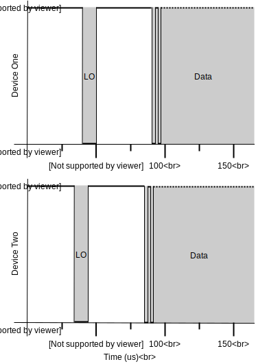
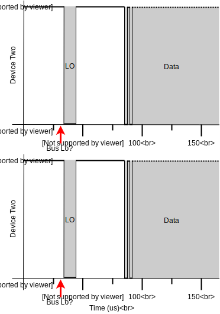

# What is JACDAC?

JACDAC (Joint Asynchronous Communications; Device Agnostic Control) is a single wire protocol for the plug and play of sensors, actuators, and microcontrollers for use within the contexts of rapid prototyping, making, and computer science education. JACDAC operates in a bus topology and requires devices have a microcontroller with UART, Timer, and GPIO interrupt capabilities.

Please visit the [motivation](#Motivation) section to read about the motivating factors for JACDAC.

# The Physical Layer

For reliable communications, embedded programmers tend to stay clear of UART: there is no common clock, the baud rate must be pre-determined, and there is no bus arbitration on the reception and transmission lines. Fortunately, hardware has improved over time adding DMA buffering and auto-baud detection thus improving reliability.

JACDAC uses the built-in UART module common to most MCUs as its communication mechanism, and instead of running two separate wires for transmission and reception, JACDAC uses just one wire for both in a bus topology. JACDAC performs bus arbitration using a GPIO interrupt attached to the bus allowing the MCU to enter a low power state between communications.

JACDAC supports four baud rates: 1Mbaud, 500Kbaud, 250Kbaud, 125Kbaud, allowing cheaper MCUs to be used. Ideally all JACDAC peripherals should run at 1Mbaud, but this baud rate is only supported on expensive MCUs which are not necessary in all scenarios. Take for example a JACDAC button peripheral, all that needs to be communicated is the state of the button (1 byte) and a control packet (12 bytes); using a $1.50 MCU to do this is extreme. By supporting multiple baud rates, JACDAC enables low cost MCUs to be used in JACDAC peripherals with small payloads, where the use of lower baud rates has minimal impact on the throughput of the bus.

UART hardware modules traditionally occupy two IO lines, one for transmission the other for reception; when idle, IO lines float high such that they read a logical one. This behaviour remains the same in JACDAC, the bus floats high when no devices are transmitting. Bus arbitration is achieved through the transmitting device driving the line low for 10 bits at the desired baud rate, beginning transmission minimally 40 microseconds later. This approach allows devices to listen to the bus in a low power mode using a GPIO interrupt, power up, and configure the UART hardware only when required.


The process described is visualised in the image above. The bus is high for a period of time, driven low for 10 microseconds (10 bits at 1Mbaud), data following 40 microseconds later.

## Physical Layer Specifications

To operate on the JACDAC bus, an MCU must be capable of:

* Communicating / receiving UART-style bytes using a single wire. (10 bits: 1 byte, 1 stop bit, 1 start bit).
* Reaching one of four baud rates: 1Mbaud, 500Kbaud, 250Kbaud, 125Kbaud.
* A GPIO with PullUp capabilities and interrupts. It's far easier if the pin used for UART tx/rx can also generate GPIO interrupts (especially in CODAL).
* The ability to keep time (whether through instruction counting or a hardware timer).

When the JACDAC bus is in idle state, all MCUs on the bus should configure their TX/RX pin to be an input with a PullUp. In this state, the bus will read high.

__NOTE: All timings from this point on are described in terms of bytes (including 1 start bit and one stop bit).__

When an MCU wants to transmit, it should drive the bus low for 10 bits at the desired baud rate and wait for a minimum of 40 microseconds before transmitting data.

* 10 us at 1 MBaud
* 20 us at 500 KBaud
* 40 us at 250 KBaud
* 80 us at 125 KBaud

When an MCU spots the beginning of a transmission (a low pulse), it has a minimum of 40 microseconds and a maximum 160 microseconds (two bytes at the slowest baud) to configure any hardware registers (if running a UART module) and software buffers to receive the header of JDPkt. After receiving the header, an MCU can choose to either receive the remainder or ignore a packet.

## InterLoData Spacing

The minimum time before data can be sent after a lo pulse is 40 microseconds, and the maximum gap before data begins is 160 microseconds (two bytes at the lowest baud); times are relative from the end of the lo pulse:


## Interbyte Spacing

The maximum permitted time between bytes is two bytes at the minimum baud rate (125KBaud):


To be JACDAC compatible, devices should never near the maximum interbyte spacing.

## Interframe Spacing

The minimum space between frames is also locked to two bytes at the minimum baud rate (125KBaud):


JACDAC devices must observe the minimum interframe spacing. The diagram above depicts an unrealistic scenario where another packet begins immediately after the interframe spacing. Devices should incorporate a random backoff so not to communicate at precisely the same times as another device.

## Error Recovery & Bus Idle Detection

If a device chooses to ignore a packet or an error condition is detected when receiving a packet, a device needs to determine when the bus has entered an idle state.

An idle bus is defined as no activity for 2 bytes at 125kbaud (160 microseconds).

To detect this time period, a device should capture the time from when the bus last transitioned from lo to hi, resetting this time if the bus transitions.

## Bus Collisions

Above we described that bus arbitration is performed through pulsing the bus low for 10 bits at the desired baud rate. However, a device could disable GPIO interrupts and initiate the process of transmission by driving the bus low whilst another device is doing the same. So what happens when the low pulses of two (or more) devices coincide?



The diagram above shows two devices overlapping their bus pulses. When data is transmitted on a perfect line, there is one possible error sources: UART framing errors. These framing errors could be caused by: 1) a mismatch between the baud rate derived from the low pulse, and the actual transmission baud rate; and/or (2) overlapping transmissions.

We can easily reduce the probability of the first error source:


In the diagram above, device two pulses low first. Before device one initiates a pulse it detects that the bus is already low and instead swaps to reception mode. _Therefore every device must check the bus state before initiating a transmission_.

Although we reduced the probability of two device pulses overlapping by checking the bus state first, there still remains some probability that two (or more) devices could pulse at the same time:



In this case, we expect the UART module on the MCU to detect an error (most likely a framing error), or the received crc to be incorrect.

# Software Layer


The image above shows JACDAC devices in the only supported topology: broadcast. Each device has a simple stack featuring: (1) a physical layer handling the transmission and reception of packets; (2) a logic layer which performs the routing of packets; to (3) device drivers running on the device. Devices are not modelled in JACDAC, instead devices expose drivers; a JACDAC device consists of 1 or more drivers. All devices are connected to a shared bus.

Since the physical layer has been discussed previously, we move onto the logic layer

## The Logic Layer

The logic layer is formed of three elements:

1. Packets that are sent using the physical layer.
2. On device routing to a destination driver.
3. A logic driver to handle device enumeration.

### Packet Structure

A JACDAC packet is simple, consisting of: a _crc_ (cyclic redundancy check) to provide guarantees of packet consistency; an _address_ indicating the source _or_ destination address of a driver; the _size_ of the data field; and finally the _data_ payload specified by a driver. When a packet is received, the protocol will route packets to the driver with the given address.

```cpp
struct JDPkt
{
    uint16_t crc;
    uint8_t  address;
    uint8_t  size;
    uint8_t  data[32];
}
```

### Routing a packet

With the limited information in the packet above, how do packets reach their destination?

So to not to fill all packets with unnecessary metadata, JACDAC devices broadcast driver information every 500 milliseconds. All devices receive this information providing a mapping from a small 8-bit address to a fully enumerated driver. Conveniently, this also allows the detection of when drivers are connected or disconnected from the bus.

Driver information is shared using a special packet type called a `ControlPacket`, which is embedded inside a standard JACDAC packet. A `ControlPacket` contains: a _packet_type_, used to differentiate between types of control packet; an _address_, which should be the same address that is used in a standard packet; any _flags_ specified by the driver (the upper eight bits of which are reserved for the logic layer); a _driver_class_ used to indicate the type of driver it is (i.e. a Joystick); a _serial_number_ that uniquely identifies a driver; and finally any additional payload information specified by the driver.

```cpp
struct ControlPacket
{
    uint8_t  packet_type;
    uint8_t  address;
    uint16_t flags;
    uint32_t driver_class;
    uint32_t serial_number;
    uint8_t  data[20];
};
```

Standard and `ControlPackets` form the basis of the JACDAC protocol.

### The Logic Driver

The logic driver is responsible for managing address allocation and conflicts, and for signalling that devices have been connected or removed from the bus. On *all* JACDAC devices, the logic driver resides on address zero.

The logic driver only receives `ControlPackets`; other drivers receive `ControlPackets` indirectly after the packet is processed by the logic driver. It then follows that all `ControlPackets` have the address zero, so to address *all* logic drivers connected to the bus.

Addresses are allocated by the logic driver and are initially computed by avoiding addresses already allocated on the bus. There is a 1 second (2 control packets) grace period where a driver control packet flags itself as uncertain. If during this period an address is contended, the uncertain driver must change it's address.

It is likely that two separate buses may be joined by a user. When this happens, addresses are resolved simply by a first-come-first-serve policy: the first device to transmit a `ControlPacket` with an address absolutely owns that address. Any device that exists on the joined bus with the same address must respect this and change address accordingly.

Connecting a new driver is handled simply: the first control packet after the address allocation period is deemed "connected". A disconnected driver is determined by the absence of two consecutive control packets (a period of 1 second).

# Drivers

Drivers build on the logic layer and expose usable APIs to the application programmer. Every driver has a class identifying the type of driver and a unique serial number to identify the driver––this is automatically performed by combining the device serial number and driver class.

At the software level, JACDAC drivers should subclass JDDriver:

```cpp
class JDDriver : public CodalComponent
{
    protected:
    JDDevice device;

    ...

    public:
    JDDriver(JDDevice d);

    virtual int fillControlPacket(JDPkt* p);

    virtual int handleControlPacket(JDPkt* p);

    virtual int handlePairingPacket(JDPkt* p);

    virtual int handlePacket(JDPkt* p);
};
```

The device member variable is accessed by the logic driver to maintain the state of an operating driver. The remaining member functions are invoked by the logic driver: `fillControlPacket`, invoked when the logic driver is queueing the drivers' control packet, allows driver specific information to be added; `handleControlPacket` is invoked when a matching control packet is received; `handlePairingPacket` is called when a pairing ControlPacket is received; and `handlePacket` is invoked whenever a packet is seen with the drivers address.

```cpp
struct JDDevice
{
    uint8_t address;
    uint8_t rolling_counter;
    uint16_t flags;
    uint32_t serial_number;
    uint32_t driver_class;
};
```

A JDDevice contains driver state used in `ControlPackets`. The _rolling_counter_ field is used by the logic driver to trigger various control packet events. The address of a driver is set by the logic driver and stored in the _address_ field. Various constructors are available for this struct, please visit the API documentation.

## Driver Paradigms

While modelling every driver as a Host is one of the key design decisions of JACDAC, it would be naive to suggest that a broadcast communication paradigm is ideal in every scenario. However, use of a broadcast paradigm enables three communication abstractions:

1. __Virtual__ –– Many Host, single peripheral.
2. __Paired__ –– Single Host, single peripheral.
3. __Broadcast__ –– Many Host, many peripheral.

An attentive reader may realise that one communication paradigm is missing: Single Host, many peripheral; in JACDAC this is realised through many Paired connections.

### Virtual Mode


The diagram shows three devices two in virtual mode, with one device acting as the "host" of the PinDriver. The PinDriver allows remote control over the state of a pin.

Virtual drivers are stubs that perform operations on a remote host; they are uninitialised until a control packet matching the class is seen on the bus. They are then populated with the host drivers' information after receiving a matching control packet. Virtual drivers emit no control packets as they are not hosting a resource. If a host disappears, virtual drivers are set to their uninitialised state.

If a virtual driver would like to use a specific driver, an optional serial number can be provided––only the matched driver will be mounted. Alternate methods of mounting virtual drivers should be handled in software by placing additional information in driver control packets.

### Paired Mode


In Paired mode, two drivers are notionally bonded to each other at the software level. In this example there are three drivers: A paired host, a paired virtual, and an uninitialised virtual driver. It is important to highlight that although a host is present on the bus, only one virtual driver is initialised as logic drivers external to the pairing ignore packets emitted from these drivers until they are unpaired––hence the virtual driver is not initialised.

When paired to another driver, JDDrivers create a Virtual stub of their partner and can observe standard packets emitted by them. Drivers should guarantee that when paired, only their partner can access and configure them. The Virtual stub allows connection events to be detected and handled.

In the diagram, it should also be noted that the Paired driver is a Virtual stub with its own address. All API calls via the virtual stub are sent using the VirtualStubs _own address_; the PairedHost receives _packets from its partner_ and can act accordingly.

### Broadcast Mode


In this example, three drivers are running the MessageBus driver in Broadcast mode. A message bus shares primitive event information via a shared bus, in this case, JACDAC. Each driver is enumerated on the bus allowing the source of an event to be determined by the MessageBus driver if required.

The key difference in this mode is how packets are routed: _packets are matched on their class, rather than their address_. Broadcast mode can be combined with paired or virtual modes previously mentioned.

<!-- # How does addressing actually work?

After the description of driver modes it might not be clear how addresses are used in JACDAC, this section provides formalisation.

## Virtual Mode


## Paired Mode


## Broadcast Mode


__Need to solidify addressing, it's currently not clear how it all fits together... need to write about the fact that because packets are received by a host driver using its own address it can infer that the packet came externally, addressing diagrams might be useful__ -->

# Motivation

Microcontrollers (MCUs) are traditionally used to monitor and actuate our environments (the Internet of Things), to prototype new products for consumers, and to enhance the creations of hobbyist-makers. However, more recently MCUs are being used to educate children on the fundamentals of computer science, helping them to understand the increasingly technologically dense world around them.

What is striking about the previous statement is the revelation that MCU programming has transformed from a _highly specialised domain_ (requiring the knowledge of low-level programming languages and the installation of complex toolchains) to a _more approachable, accessible domain_––children can now write and compile complete programs directly in a web browser using simpler higher-level programming languages. Even more striking is the _power of_ these higher level languages: one can write complete I2C or SPI drivers without learning any C++.

Of course, children are not writing SPI or I2C drivers in these higher level languages, but rather _businesses looking to create accessories_ featuring peripherals that enhance the base offerings of the educationally focussed MCU boards they use. Businesses use these higher level languages because they are simpler than C or C++, and driver code is portable to any other MCU in the language ecosystem.

I2C and SPI are widely used for communicating with peripherals and for good reason: these protocols are efficient, fast, and well-defined. However, whilst these protocols are great for peripherals mounted on the _same_ circuit board, they are hard for novice users to use with _external_ peripherals: asking a classroom of thirty 11––12 year old children to connect four wires correctly results in many failing peripherals.

Various educational MCU-boards have devised solutions for this problem: the Arduino ecosystem uses "shields", a set of stackable peripheral boards that can only be plugged one-way to reach the main MCU. Also used by Arduino are grove connectors, a simple wire based ecosystem that allows the one-way connection of peripherals using a rugged connector. Other devices create custom connectors: the micro:bit features an edge connector for GPIO that allows easier, direct integration with accessories. Each of these approaches has a drawback: Arduino shields cannot be mounted anywhere other than directly onto the main board, grove connectors still require learning and expertise to connect things together, and the micro:bit's edge connector only allows a limited number of accessories to be connected at a time; all approaches increase the overall cost of accessories.

As well as requiring an understanding of basic electronics, the programming interface provided by I2C and SPI is conceptually low-level: it uses addresses and registers to communicate with peripherals. Each I2C or SPI component has its own register layout that is chip specific––each different model of accelerometer will have a different register map. Unfortunately, this means that whilst driver code can be ported to any MCU in the language ecosystem, the addresses and registers used by driver code are specific to each peripheral. For I2C the situation gets more problematic as each model of a peripheral is assigned a device address which is peripheral unique, but not chip unique, so if two of the same model of peripheral are connected to the bus, addressing collisions occur.

However, the greatest problem with I2C or SPI is the communication paradigm: Host / Peripheral (used in place of outdated Master / Slave terminology). This paradigm dictates that a single device orchestrates the operation of all devices on the bus, manually configuring, writing, and reading their memory. This scenario caters well for when there is only one Host device on the bus, but what if you want two Host devices to communicate with each other? Or you want to connect two devices with the exact the same peripherals by joining their buses? Or perhaps you want two Hosts to share the same peripheral? The only remaining way to realise these scenarios is to add a network interface, or define a custom serial protocol.

For businesses, the choice of communication protocol for external peripherals seems a simple, harmless decision, however this choice has real-world impacts on user experience. Outside of the domain of education, these issues also impact hobbiests as they wire complex animatronics with many sensors, and professional engineers as they prototype new products with various permutations of hardware.

We present JACDAC (Joint Asynchronous Communications, Device Agnostic Control): a single wire broadcast protocol for the plug and play of accessories for microcontrollers. JACDAC requires no additional hardware to operate and abstracts accessories as a set of interfaces rather than hardware registers so that driver code can be shared across different implementations. It uses dynamic addressing so that multiple of the same accessory can be connected simultaneously and it offers three different communication abstractions to cater for an ever-diverse set of use scenarios for accessories.