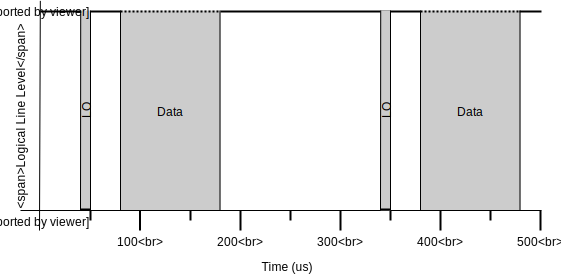

# JACDAC: Joint Asynchronous Communications, Device Agnostic Control.

## What is JACDAC?

JACDAC is a single wire serial protocol for the plug and play of accessories for embedded computers.

## Why do we need _another_ protocol?

Conventionally SPI and I2C are used to communicate with other devices over a wire. I2C and SPI principally work in Central/Peripheral (used in place of outdated Master/Slave terminology) mode: One central directs the operation of all peripherals, configuring and interrogating them as desired.

I2C uses static addresses for all components i.e. all MMA8653 accelerometers will have the same address. Each I2C component specifies its own register map and registers can be directly accessed by combining the component's address and register offset. I2C requires two wires to operate: _SCL_ to synchronise the communication speed, and _SDA_ for data payloads.

Instead of static addressing, SPI uses the peripheral select wire to indicate the peripheral to be accessed. SPI components require register offsets to be communicated over the MOSI (Central out peripheral in) line, and the selected peripheral responds using the MISO (Central in peripheral out) line. Multi-central modes for SPI and I2C are not well-supported.

However, in the world of the Internet of Things (IoT), peer-to-peer scenarios are common place: programmers often want to share data with other devices in the vicinity. But what solution is available for sharing data locally through wired communications? I2C or SPI cannot be used because of their addressing approaches and communication topology (single Central only)––if two devices with the same components join buses, how are addresses resolved? One could develop a custom UART based protocol, or add ethernet capabilities to a device and run IPv4, but each of these approaches have obvious drawbacks.

Built on UART, JACDAC requires _no additional hardware to operate_ as UART is supported in hardware by all modern processors. Peer to peer scenarios are enabled through a _broadcast topology_ where every device is a Central. Communications speeds are fixed to 1 mBaud, which means only _a single data wire_ is required.

## A UART based solution

For reliable communications, embedded programmers tend to stay clear of UART: there is no common clock, the baud rate must be pre-determined, and there is no bus arbitration. Fortunately, hardware has improved over time adding DMA buffering and auto-baud detection thus improving reliability. To sidestep the issue of determining the baudrate, JACDAC is fixed to 1 mBaud; the problem of bus arbitration still remains.

UART hardware modules traditionally occupy two IO lines, one for transmission the other for reception; when idle, IO lines float high such that they read a logical one. This behaviour remains the same in JACDAC, the bus floats high when no devices are transmitting. Bus arbitration is achieved through the transmitting device driving the line low for 10 microseconds, beginning transmission 150 microseconds later. This approach allows devices to listen to the bus in a low power mode using a GPIO interrupt, and power up and configure the UART hardware only when required.

A 10 microsecond window is used for two reasons: (1) the probability of a transmission collision is reduced; and (2) to simplify error logic---a low period of 30 microseconds or more is enough time for  UART hardware to be operable and a break condition to be generated. It is then challenging to differentiate between a true UART error, and an error generated by the low period.



The process described is visualised in the image above. The bus is high for a period of time, driven low for 10 microseconds, data following 150 microseconds later.

## A broadcast paradigm


The image above shows JACDAC devices in the only supported topology: broadcast. Each device has a simple stack featuring: (1) a physical layer handling the transmission and reception of packets; (2) a logic layer which performs the routing of packets; to (3) device drivers running on the device. Devices are not modelled in JACDAC, instead devices expose drivers; a JACDAC device consists of 1 or more drivers. All devices are connected to a shared bus.

Since the physical layer has been discussed previously, we move onto the logic layer

### The Logic Layer

The logic layer is formed of three elements:

1. Packets that are sent using the physical layer.
2. On device routing to a destination driver.
3. A logic driver to handle device enumeration.

#### Packet Structure

A JACDAC packet is simple, consisting of: a _crc_ (cyclic redundancy check) to provide guarantees of packet consistency; an _address_ indicating the source _or_ destination address of a driver; the _size_ of the data field; and finally the _data_ payload specified by a driver. When a packet is received, the protocol will route packets to the driver with the given address.

```cpp
struct JDPkt
{
    uint16_t crc;
    uint8_t  address;
    uint8_t  size;
    uint8_t  data[32];
}
```

#### Routing a packet

With the limited information in the packet above, how do packets reach their destination?

So to not to fill all packets with unnecessary metadata, JACDAC devices broadcast driver information every 500 milliseconds. All devices receive this information providing a mapping from a small 8-bit address to a fully enumerated driver. Conveniently, this also allows the detection of when drivers are connected or disconnected from the bus.

Driver information is shared using a special packet type called a `ControlPacket`, which is embedded inside a standard JACDAC packet. A `ControlPacket` contains: a _packet_type_, used to differentiate between types of control packet; an _address_, which should be the same address that is used in a standard packet; any _flags_ specified by the driver (the upper eight bits of which are reserved for the logic layer); a _driver_class_ used to indicate the type of driver it is (i.e. a Joystick); a _serial_number_ that uniquely identifies a driver; and finally any additional payload information specified by the driver.

```cpp
struct ControlPacket
{
    uint8_t  packet_type;
    uint8_t  address;
    uint16_t flags;
    uint32_t driver_class;
    uint32_t serial_number;
    uint8_t  data[20];
};
```

Standard and `ControlPackets` form the basis of the JACDAC protocol.

#### The Logic Driver

The logic driver is responsible for managing address allocation and conflicts, and for signalling that devices have been connected or removed from the bus. On *all* JACDAC devices, the logic driver resides on address zero.

The logic driver only receives `ControlPackets`; other drivers receive `ControlPackets` indirectly after the packet is processed by the logic driver. It then follows that all `ControlPackets` have the address zero, so to address *all* logic drivers connected to the bus.

Addresses are allocated by the logic driver and are initially computed by avoiding addresses already allocated on the bus. There is a 1 second (2 control packets) grace period where a driver control packet flags itself as uncertain. If during this period an address is contended, the uncertain driver must change it's address.

It is likely that two separate buses may be joined by a user. When this happens, addresses are resolved simply by a first-come-first-serve policy: the first device to transmit a `ControlPacket` with an address absolutely owns that address. Any device that exists on the joined bus with the same address must respect this and change address accordingly.

Connecting a new driver is handled simply: the first control packet after the address allocation period is deemed "connected". A disconnected driver is determined by the absence of two consecutive control packets (a period of 1 second).

## Drivers

Drivers build on the logic layer and expose usable APIs to the application programmer. Every driver has a class identifying the type of driver––multiple drivers can use the same class, but this behaviour should be handled by driver code. A unique serial number should be assigned to each driver, this is automatically performed by combining the device serial number and driver class.

At the software level, JACDAC drivers should subclass JDDriver:

```cpp
class JDDriver : public CodalComponent
{
    protected:
    JDDevice device;

    ...

    public:
    JDDriver(JDDevice d);

    virtual int fillControlPacket(JDPkt* p);

    virtual int handleControlPacket(JDPkt* p);

    virtual int handlePairingPacket(JDPkt* p);

    virtual int handlePacket(JDPkt* p);
};
```

The device member variable is accessed by the logic driver to keep track of the state of an operating driver. The remaining member functions are invoked by the logic driver: `fillControlPacket`, invoked when the logic driver is queueing the drivers' control packet, allows driver specific information to be added; `handleControlPacket` is invoked when a matching control packet is received; `handlePairingPacket` is called when a pairing ControlPacket is received; and `handlePacket` is invoked whenever a packet is seen with the drivers address.

```cpp
struct JDDevice
{
    uint8_t address;
    uint8_t rolling_counter;
    uint16_t flags;
    uint32_t serial_number;
    uint32_t driver_class;
};
```

A JDDevice contains driver state used in `ControlPackets`. The _rolling_counter_ field is used by the logic driver to trigger various control packet events. The address of a driver is set by the logic driver and stored in the _address_ field. Various constructors are available for this struct, please visit the API documentation.

### Driver Paradigms

While modelling every driver as a Central is one of the key design decisions of JACDAC, it would be naive to suggest that a broadcast communication paradigm is ideal in every scenario. However, basing JACDAC on a broadcast paradigm allows other communication paradigms to be added. Therefore, JACDAC supports three communication paradigms:

1. __Virtual__ –– Many central, single peripheral.
2. __Paired__ –– Single central, single peripheral.
3. __Broadcast__ –– Many central, many peripheral.

An attentive reader may realise that one communication paradigm is missing: Single central, many peripheral; in JACDAC this is realised through many Paired connections.

#### Virtual Mode


The diagram shows three devices two in virtual mode, with one device acting as the "host" of the pin driver.

Virtual drivers are stubs that perform operations on a remote host; they are uninitialised until a control packet matching the class is seen on the bus. They are then populated with the host drivers' information after receiving a control packet. Virtual drivers emit no control packets as they are not hosting a resource. If a host disappears, virtual drivers are set to their uninitialised state.

If a virtual driver would like to use a specific driver, a serial number can optionally be specified––only the matched driver will be mounted. Alternate methods of mounting virtual drivers should be handled in drivers by placing additional information in driver control packets.

#### Paired Mode


In Paired mode, two devices are paired.

PairedHost PairedVirtual PairedHost

#### Broadcast Mode

